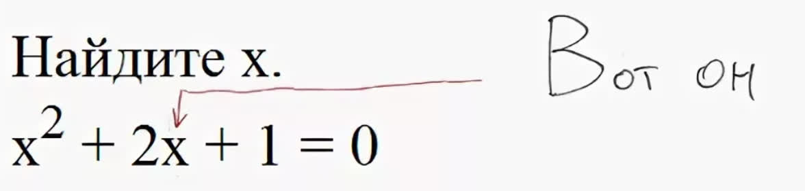

# Квадратка

Программа для решения квадратных уравнений



## О программе

Программа работает из командной строки. При запуске потребуется ввести коэффициенты уравнения, после чего программа вычислит корни и выведет результат на экран.

### Краткая документция

Укажите флаги -h или --help для получения справки.\
Укажите флаги -p или --pranc для использования шуточной версии программы.\
Подробную документацию программы(всех её функций) читайте в 'docs/html/index.html'

## Сборка

### Зависимости

Для сборки вам необходимы пакеты `git` `gcc-g++` `make` `libasan` `libubsan`.

Установка пакетов для Fedora:
```sh
$ sudo dnf install git gcc-g++ make libasan libubsan
```

Установка пакетов для Ubuntu:
```sh
$ sudo apt install git g++ make libasan5 libubsan1
```

### Сборка

Клонируйте репозиторий:
```sh
$ git clone https://github.com/kisich5812/kvadratka/
```

Далее:

```sh
$ make
```

В случае успешной сборки в каталоге появится исполняемый файл 'kvadratnoe-ur'

Для удаления всех файлов созданных при сборке:
```sh
$ make clean
```

Для удаления объектных файлов:
```sh
$ make clean_obj
```
